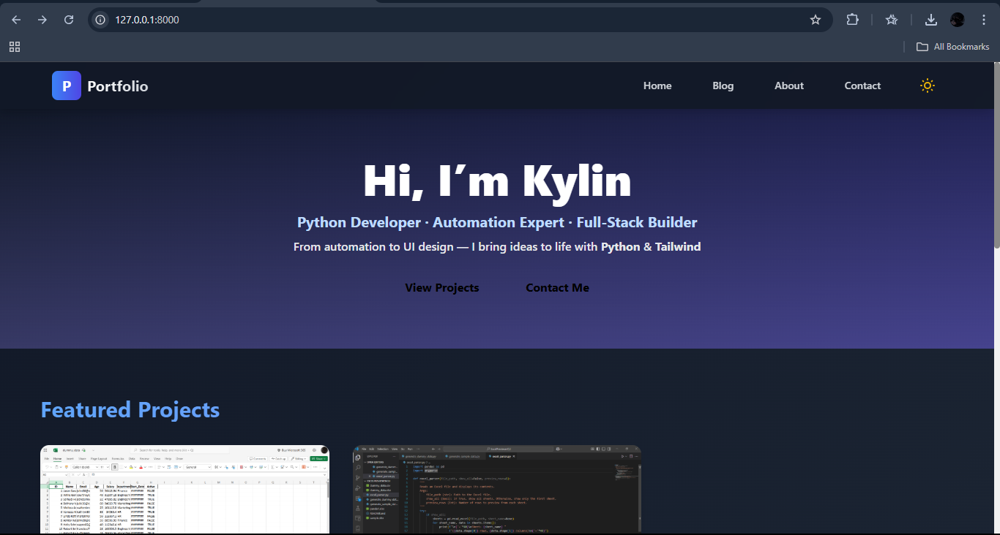

# 🧑‍💻 Kylin's Developer Portfolio

This is my personal developer portfolio site built with **Django**, **Tailwind CSS**, and **Python**. It showcases selected projects, a blog, and a contact form — all with a focus on clean design and smooth user experience.

---

## 🚀 Live Demo

[Visit My Upwork Profile](https://www.upwork.com/freelancers/kylinace)

---

## 📁 Features

* 🌐 **Homepage**: Responsive hero section with animated background and call-to-action buttons
* 🧠 **About Page**: Overview of skills, tools, and technologies
* 📚 **Blog Page**: Displays published posts using Django's ORM
* 🛠 **Projects Section**: Dynamic list of Django admin-controlled portfolio entries
* 📬 **Contact Page**: Functional contact form using Django's built-in forms

---

## 🛠 Stack

* **Backend**: Python, Django
* **Frontend**: Tailwind CSS
* **Database**: SQLite (can switch to PostgreSQL)
* **Deployment-Ready**: Supports production setup

---

## 🧪 Run Locally

### Clone the repo

```bash
git clone https://github.com/Kylin-Ace/django-portfolio.git
cd django-portfolio
```

### Install dependencies

```bash
pip install -r requirements.txt
```

### Apply migrations & run

```bash
python manage.py migrate
python manage.py runserver
```

Then open: [http://localhost:8000](http://localhost:8000)

---

## 📸 Screenshots

Coming soon — visual previews of key pages

---

## 📬 Contact

Want to work together? Reach out on [Upwork](https://www.upwork.com/freelancers/kylinace) or use the contact form on the site.

---

## 📄 License

MIT License

---

## 🙌 Acknowledgements

* Tailwind UI inspirations
* Django Docs
## Images

